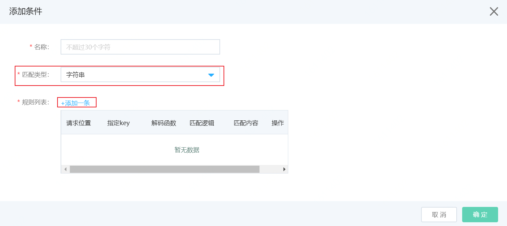
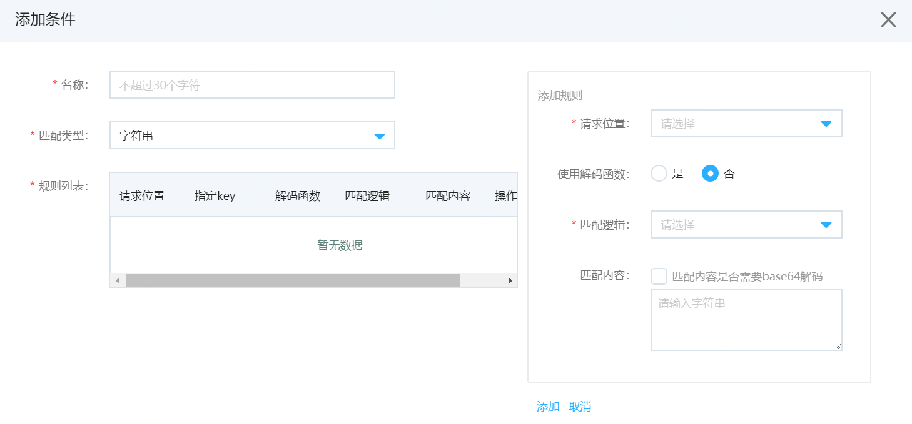
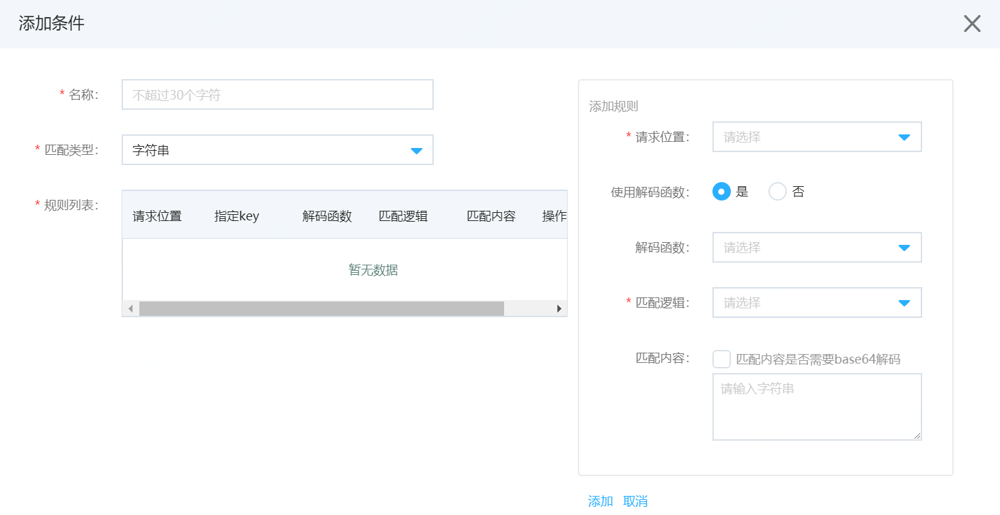
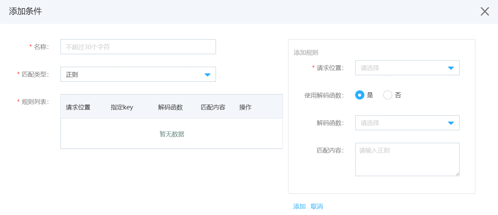
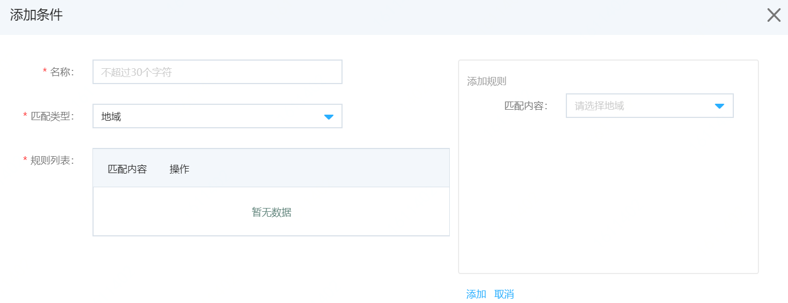
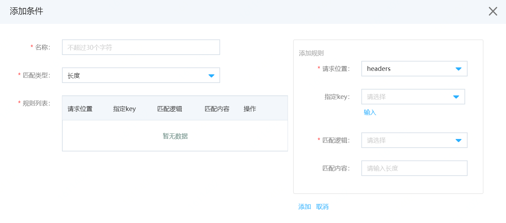
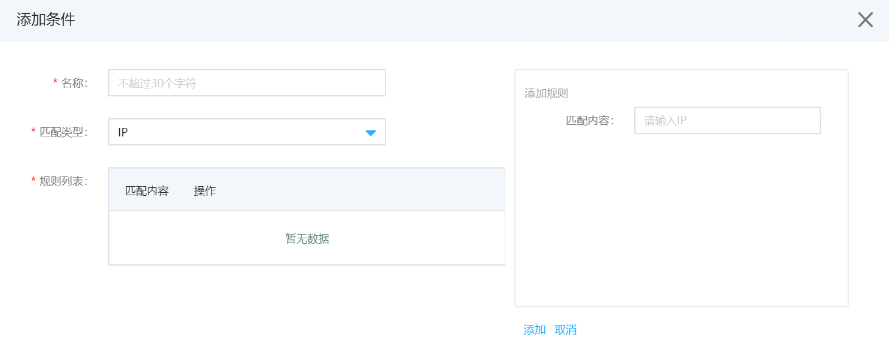
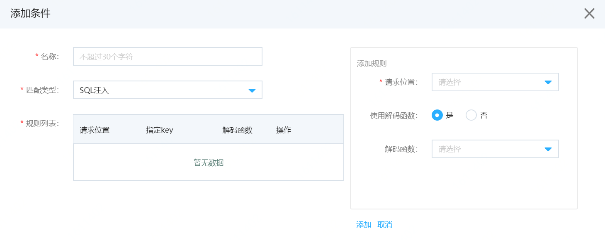
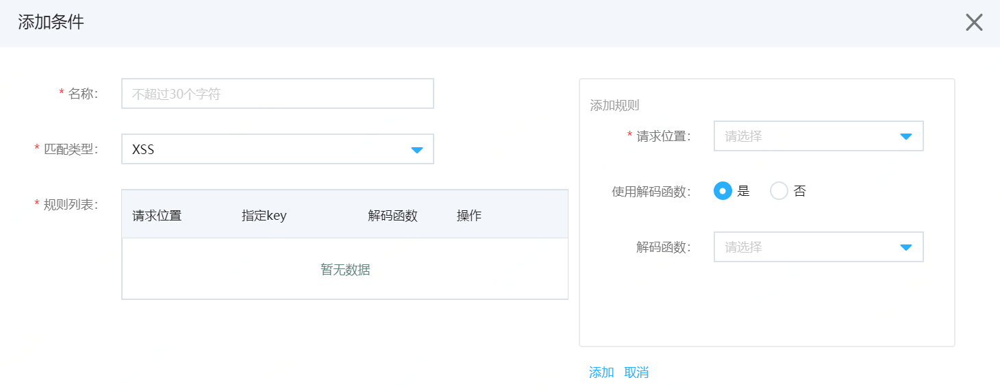
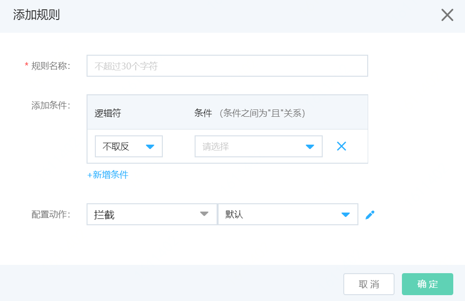

# 设置自定义防护

网站接入Web应用防火墙后，您可以为其开启自定义防护策略功能。自定义防护策略允许您自定义基于精确匹配条件的访问控制规则。自定义防护策略支持随业务场景定制，可用于盗链防护、网站管理后台保护等场景。您可以根据实际需求配置自定义规则。

## 前提条件

- 已开通Web应用防火墙实例。更多信息，请参见[开通Web应用防火墙](https://docs.jdcloud.com/cn/web-application-firewall/purchase-process)。
- 已完成网站接入。更多信息，请参见[添加网站](https://docs.jdcloud.com/cn/web-application-firewall/step-1)。

## 操作步骤

1、登录[Web应用防火墙控制台](https://cloudwaf-console.jdcloud.com/overview/business)。

2、在左侧导航栏，单击**网站配置**。

3、在**网站配置**页面定位到要设置的域名，在操作栏单击**防护配置**。

4、在防护配置页面，打开**Web防护**页签，定位到**自定义防护**模块，开启开关如下图。

5、添加规则前，先添加自定义防护条件。点击右侧**防护条件**Tab页，如下图。

6、点击**添加条件**，按照下述步骤添加条件。

​	i.输入条件名称。

​	ii.输入匹配类型：防护条件的判断维度，支持选择**字符串**、**正则**、**地域**、**长度**、**IP**、**SQL注入**、**XSS**等类型。

​    iii.点击**添加一条**，右侧弹出添加防护条件规则，如下图，按照下表说明项添加规则后，点击**确定**。

| 匹配类型    | 添加条件说明                                                 |
| ----------- | ------------------------------------------------------------ |
| **字符串**  | 1.**请求位置**：选择需要字符串匹配的位置，支持选择**headers**、**cookie**、**args**、**body**、**uri**、**method**等位置。 2.**使用解码函数**：对请求位置选出的内容，是否需要使用解码函数。如果选择是，则需要选择解码函数。 3.**解码函数**（可选）：选择使用解码函数后，解码函数可选择：**转为小写**、**去空格**、**base64解码**、**URL解码**、**HTML解码**。支持多选，选择多个时，将按照选择顺序执行解码操作。 4.**匹配逻辑**：支持**完全匹配**、**前缀匹配**、**后缀匹配**和**包含匹配**。 5.**匹配内容**：待匹配的字符串内容。**匹配内容是否需要base64解码**：是指待匹配内容是否需要WAF解码后匹配，如果输入的是编码后的内容，需要勾选。 6.点击**添加**，完成添加条件中的一条规则。 |
| **正则**    | 1.**请求位置**：选择需要匹配正则表达式的位置，支持选择**headers**、**cookie**、**args**、**body**、**uri**、**method**等位置。 2.**使用解码函数**：对请求位置选出的内容，是否需要使用解码函数。如果选择是，则需要选择解码函数。  3.**解码函数**（可选）：选择使用解码函数后，解码函数可选择：**转为小写**、**去空格**、**base64解码**、**URL解码**、**HTML解码**。支持多选，选择多个时，将按照选择顺序执行解码操作。 4.**匹配内容**：待匹配的正则表达式。 5.点击**添加**，完成添加条件中的一条规则。 |
| **地域**    | 1.**匹配内容**：可以选择匹配的地域。支持选择国内各省市地区。  2.点击**添加**，完成添加条件中的一条规则。 |
| **长度**    | 1.**请求位置**：选择需要判断长度的位置，支持选择**headers**、**cookie**、**args**、**body**、**uri**、**method**等位置。 2.**指定key**：当请求位置选择headers、cookie、args时，支持选择指定key，也可以输入key。 3.**匹配逻辑**：对请求位置选出内容的长度，进行匹配的逻辑，支持选择**等于、大于、小于**。 4.**匹配内容**：输入待匹配的长度值。 5.点击**添加**，完成添加条件中的一条规则。 |
| **IP**      | 1.**匹配内容**：输入IP地址。支持输入CIDR格式的地址，IPv4地址和IPv6地址。  2.点击**添加**，完成添加条件中的一条规则。 |
| **SQL注入** | 1.**请求位置**：利用智能语义引擎，可以对请求位置的内容进行SQL注入判断，支持选择**headers**、**cookie**、**args**、**body**、**uri**、**method**等位置。 2.**使用解码函数**：对请求位置选出的内容，是否需要使用解码函数。如果选择是，则需要选择解码函数。  3.**解码函数**（可选）：选择使用解码函数后，解码函数可选择：**转为小写**、**去空格**、**base64解码**、**URL解码**、**HTML解码**。支持多选，选择多个时，将按照选择顺序执行解码操作。 4.点击**添加**，完成添加条件中的一条规则。 |
| **XSS**     | 1.**请求位置**：利用智能语义引擎，可以对所在位置的内容进行SQL注入判断，支持选择**headers**、**cookie**、**args**、**body**、**uri**、**method**等位置。 2.**使用解码函数**：对请求位置的选出的内容，是否需要使用解码函数。如果选择使用解码函数，需要选择解码函数。  3.**解码函数**（可选）：选择使用解码函数后，解码函数可选择：**转为小写**、**去空格**、**base64解码**、**URL解码**、**HTML解码**。支持多选，选择多个时，将按照选择顺序执行解码操作。 4.点击**添加**，完成添加条件中的一条规则。 |

**说明：以上为一个防护条件中添加一条子规则，一个防护条件，最多添加3条子规则。三条规则是“或”的关系，即命中一个子规则，该条防护条件为真。**

7.添加完防护条件，界面如下图。点击右上角**防护规则**Tab，切换到防护规则页面。

8.点击**添加规则**，如下图，按照下表说明添加防护规则。

| 匹配类型      | 添加防护规则说明                                             |
| ------------- | ------------------------------------------------------------ |
| **规则名称**  | 可以输入防护规则名称，不超过30个字符。                       |
| **添加条件 ** | **条件**：下拉选择框中选择已添加的防护条件。 **逻辑符**：对选择的防护条件的操作，可选**取反**或**不取反**。 点击**新增条件**，可以添加新的防护条件，最多添加5条防护条件，这些条件是**与**的关系，当条件都满足，执行配置动作。 |
| **配置动作**  | 当请求满足上述条件，则执行配置动作，包括： **观察**：放行请求，只记录日志。 **人机交互**：人机算法挑战 **拦截**：拦截请求返回默认493页面，支持返回自定义页面（需先上传自定义页面）。 |