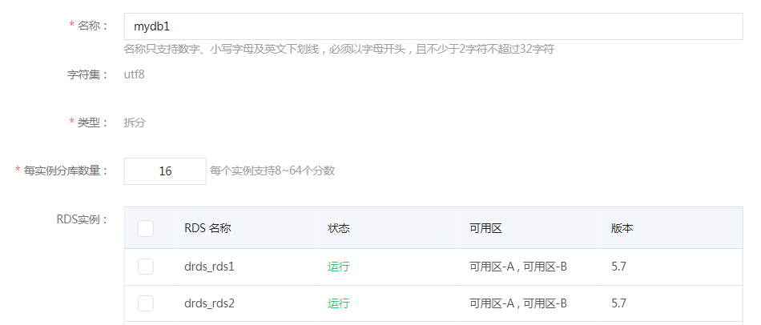

# 创建数据库

**1. 进入【库管理】页面**

点击实例名，进入实例页面，选择 **【库管理】** 页面，点击 **【创建库】**

**2. 输入数据库相关信息**

**库名称：** 数据库名称，数据库名称的规则在控制台上有提示

**字符集：** 目前支持UTF8字符集，其他字符集后续版本陆续推出

**类型：** 只支持“拆分”，即该数据库会实际对应到多个MySQL实例上的多个数据库

**每实例分库数:** 可以自定义在每个RDS MySQL上要创建的分库的数目。目前每个RDS实例支持8~64个分库。

**选择后端MySQL实例**

此处会列出该DRDS所在的VPC下的所有MySQL实例，DRDS会在自动每个MySQL实例上创建8个数据库，并保存相应的对应关系。比如选择了4个实例，每实例分库数8，那么DRDS会在这每个实例上创建8个数据库，总共32个；如果选择10个实例，则会总共创建80个数据库。

用户无需手工在MySQL上创建各个分库

