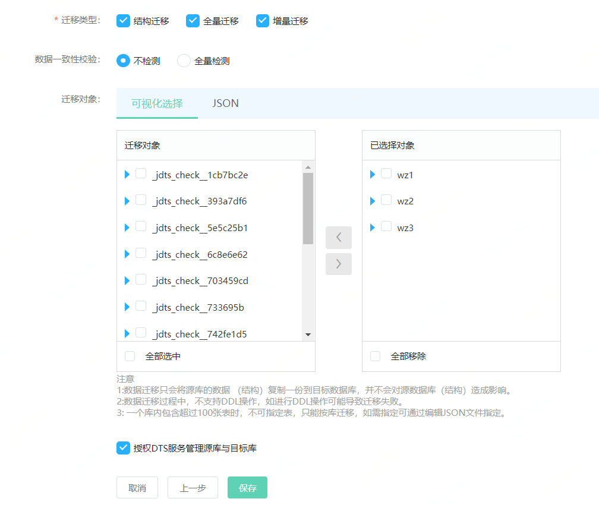

# 创建迁移任务

在DTS 控制台，只需几步简单操作，即可创建数据迁移任务。

本文介绍创建迁移任务的通用配置流程，不同类型的数据库在配置时略有不同，可参照操作指南中的迁移说明。

## 准备工作

- 创建作为迁移目标数据库的云数据库实例。
- 待迁移数据库已开启公网IP或已开通专线可与目标数据库可连通。
- 源数据库与目标数据库已创建有相应权限的迁移账号。

## 操作步骤

1. 登录 DTS 控制台。

2. 在DTS列表页，点击**创建迁移任务**，进入创建迁移任务页面。

3. 在创建迁移任务页，填写任务名称、源库信息、目的库信息。

   

   任务名称：

   名称长度不能少于2字符且不超过32个字符，只支持中文、数字、大小写字母、英文下划线及中划线。

   源库信息：

   - 实例类型，可选“有公网IP的自建数据库”、“通过专线连接的自建数据库”。

   - 数据库类型，源数据库类型，支持MySQL、Percona、MariaDB、SQL Server、MongoDB。
   - 数据库地址，可填写域名或IP。
   - 端口，数据库端口。
   - 数据库账号
   - 数据库密码

   目标库信息：

   - 数据库类型
   - 实例地域，目标实例所在地域。
   - 实例ID
   - 数据库账号
   - 数据库密码
   - 查询DTS IP段，用于查询DTS服务的公网IP，如果源数据库启用了IP白名单，需将此IP段加入到白名单，以确保DTS服务可以连接到源数据库。 

4. 先写完成，点击**下一步**，进入下一步选择迁移类型与迁移对象。

   

   迁移类型：可选择结构迁移、全量迁移、增量迁移。

   数据一致性校验：可选择不检测或全量检测。

   迁移对象：

   - 源库类型为“有公网IP的自建数据库”时，支持**可视化选择**和**JSON**两种方式定义要迁移的库表。
   - 源库类型为“通过专线连接的自建数据库”时，只支持通过**JSON**定义要迁移的库表。

5. 同意授权DTS服务管理源库与目标库”。

6. 保存任务，等待迁移任务创建完成。

