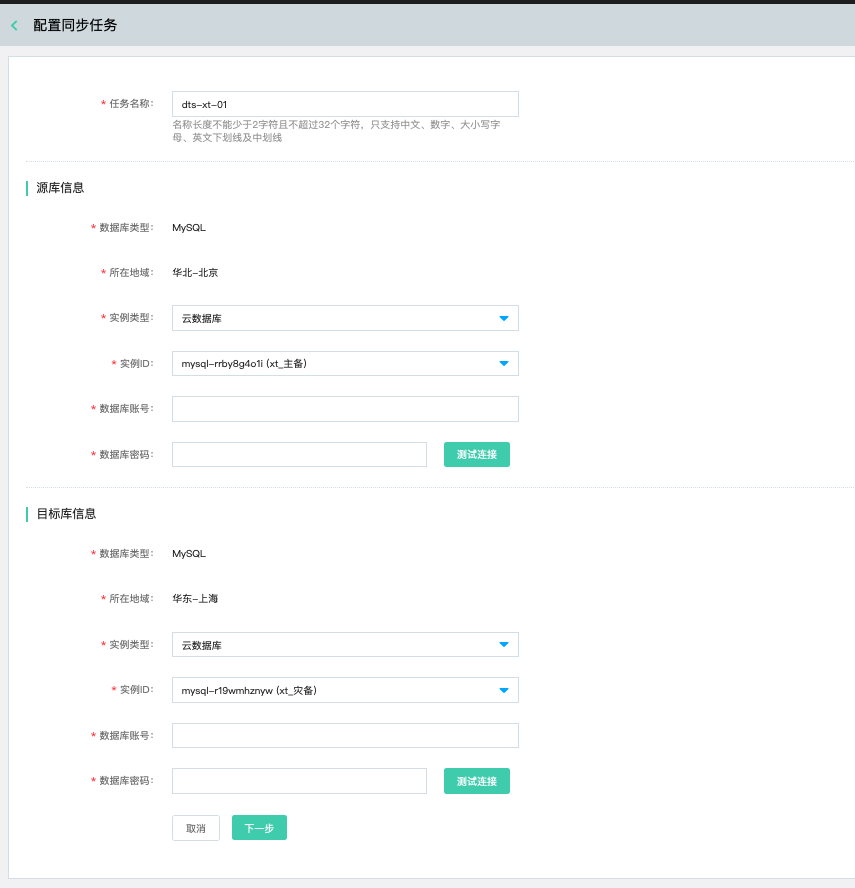
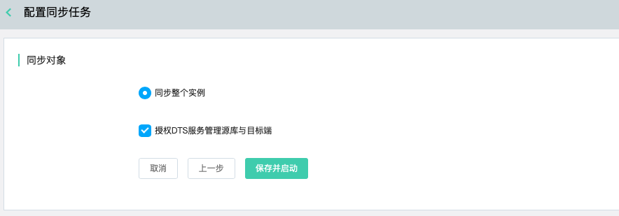

# 配置同步任务

同步任务创建完成后，需配置订阅任务的源库与目标端相关信息，以下说明如何配置。

## 准备工作

- 已创建作为源库的云数据库 MySQL 主备实例。
- 已创建作为灾备的云数据库 MySQL 灾备实例。

## 操作步骤

1. 登录 [DTS控制台](http://dts-console.jdcloud.com/subscription/list)，在左侧菜单中点击**数据同步**。

2. 在数据同步列表页，选择目标任务，点击**配置同步任务**，打开同步任务配置页。

   

3. 在创建同步任务页，填写相关配置。

   

   - 任务名称

   - 源库信息

     - 实例类型：当前仅支持云数据库。
     - 实例ID：选择当前地域下云数据库MySQL实例ID。
     - 数据库账号
     - 数据库密码
     - 测试连接：点击后，测试当前MySQL实例是否可连接。

   - 目标库

     - 实例类型：当前仅支持云数据库。
     - 实例ID：选择当前地域下云数据库MySQL实例ID。
     - 数据库账号
     - 数据库密码
     - 测试连接：点击后，测试当前MySQL实例是否可连接。

   - 填写无误后，点击“下一步”，保存配置信息并启动。

     

4. 在任务列表页可查看当前任务信息。

   

