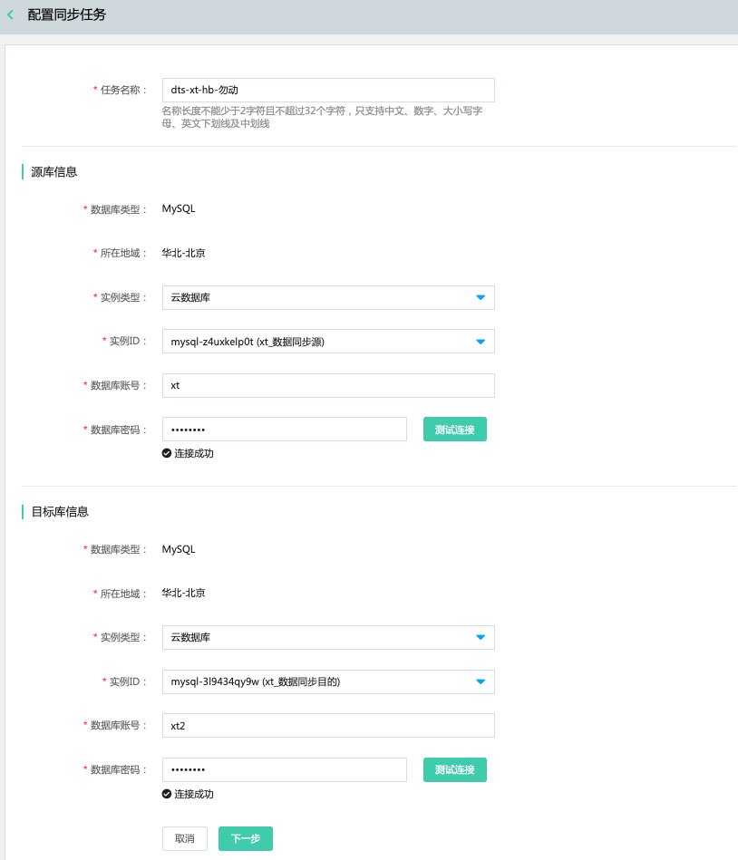
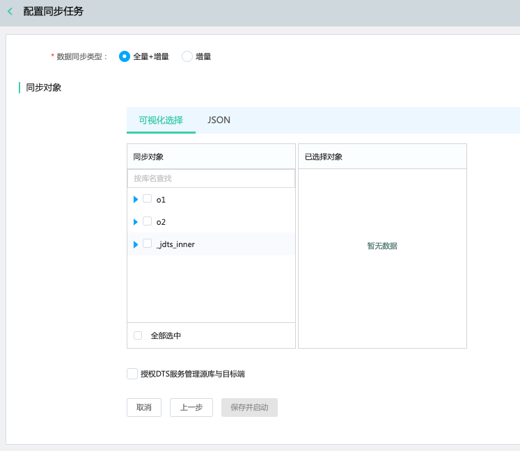

# 配置数据同步任务

同步任务创建完成后，需配置订阅任务的源库与目标端相关信息，以下说明如何配置。

## 准备工作

- 源库与目标库已存在。
- 源库与目标库已创建有相应权限的账号。

## 操作步骤

1. 登录 [DTS控制台](http://dts-console.jdcloud.com/subscription/list)，在左侧菜单中点击**数据同步**。

2. 在数据同步列表页，选择目标任务，点击**配置同步任务**，打开同步任务配置页。

   

3. 在创建同步任务页，填写相关配置。

   

   - 任务名称
   - 源库信息

     - 数据库类型：创建同步任务时选择的数据库类型。
     - 实例类型：可选择云数据库、通过IPv6/专线/内网连接的自建数据库。
     - 实例ID：如实例类型选择云数据库，则需选择当前迁移任务所在VPC内的云数据库MySQL实例ID。
     - 数据库地址与端口：如实例类型为自建数据库，需要填写数据库账号。
     - 数据库账号
     - 数据库密码
     - 测试连接：点击后，测试当前MySQL实例是否可连通。
   - 目标库

     - 数据库类型：创建同步任务时选择的数据库类型。
     - 实例类型：可选择云数据库、通过IPv6/专线/内网连接的自建数据库。
     - 实例ID：如实例类型选择云数据库，则需选择当前迁移任务所在VPC内的云数据库MySQL实例ID。
     - 数据库地址与端口：如实例类型为自建数据库，需要填写数据库账号。
     - 数据库账号
     - 数据库密码
     - 测试连接：点击后，测试当前MySQL实例是否可连接。

   - 填写无误后，点击“下一步”。

4. 选择同步类型与对象

  

  - 数据同步类型：支持选择“全量+增量”和“增量”。

    数据类型为“增量”时，需填写初始位置 GTID。

    

  - 同步对象

    支持**可视化选择**和**JSON**两种方式定义要同步的库表。

    可视化选择支持选择库后编辑筛选表的规则，支持指定表或排除表，表名称支持“*”通配符。

    

  - 源库类型为“通过专线连接的自建数据库”时，只支持通过**JSON**定义要迁移的库表，格式请参考：[JSON方式定义迁移对象](Define-The-Migration-Object-in-JSON.md)。

5. 保存任务，在数据同步任务列表页可查看当前任务信息。

   

