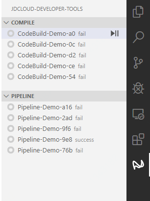

# 入门示例

1. 在云编译/流水线服务中**创建示例，该示例会创建一个**java-demo代码仓库，并将该代码仓库关联至**云编译/流水线任务。**

2. **跳转至示例中的代码库**java-demo。获取代码仓库克隆地址。例：git@code.jdcloud.com:XXXXXXX/java-demo.git

3. 在VScode中利用内置的git命令拉取java-demo仓库到本地

   git clone git@code.jdcloud.com:XXXXXXX/java-demo.git

   

4. 通过VScode打开该项目，可以从侧边栏看到该代码相关的云编译和流水线任务。COMPILE下方是该项目最近的5个云编译任务，PIPLELINE是该项目最近的5个流水线任务

   

5. 选择任务后可以点击启动按钮，启动相应的服务。在服务运行的过程中，VScode自带的OUTPUT区域会显示执行过程中的回显的日志信息。同时此任务记录也可以通过控制台查询到。
 

