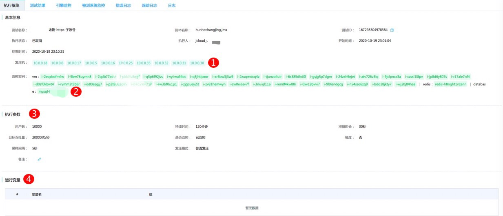
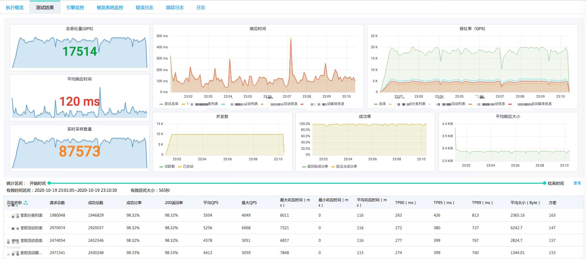
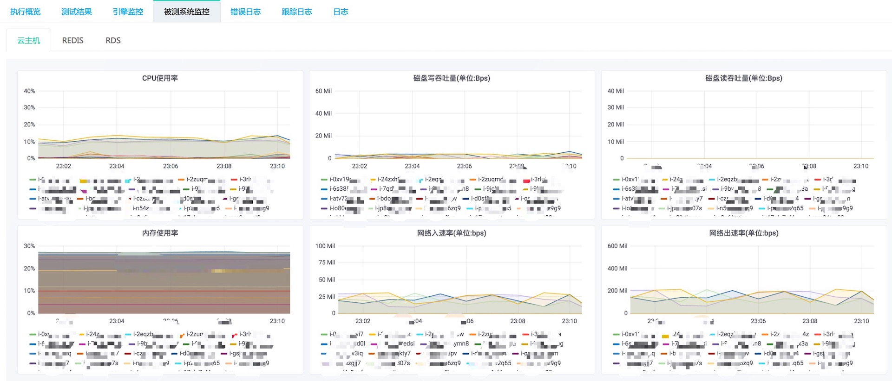
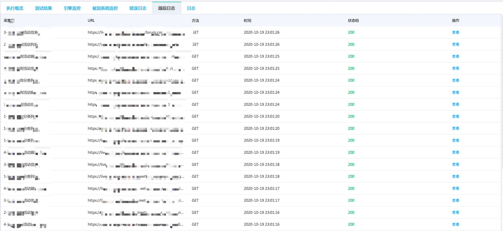
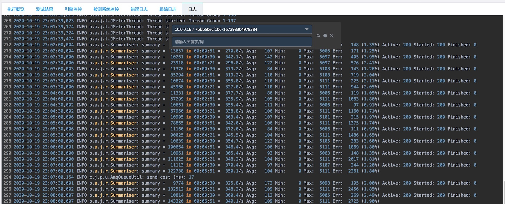

# 结果分析
## 结果分析-执行概览
### 数据项说明
执行概览页主要展示本次测试场景相关的信息，包括压测场景的基本信息、执行参数和运行时变量，请参考如下说明。

|序号|数据项|说明|
|---|---|---|
|1|发压机|本次压测调度的发压机个数|
|2|监控实例|本次压测配置的待监控实例|
|3|执行参数|本次压测设置的并发数、持续时长等相关执行参数|
|4|运行变量|体现到本次压测脚本中的用户自定义变量|

## 结果分析-测试结果
### 数据项说明
测试结果页是展示本次压测场景的性能结果核心指标的页面，请参考如下说明。

图表的说明如下：

|序号|数据项|说明|
|---|---|---|
|1|图：总吞吐量(QPS)|压测期间的总平均qps|
|2|图：平均响应时间|压测期间的总平均响应时间|
|3|图：实时采样数量|最近1个采样间隔的采样数量|
|4|图：响应时间|每个接口以及测试总体的平均响应时间|
|5|图：吞吐率(QPS)|每个接口以及测试总体的QPS|
|6|图：并发数|活跃及已启动的并发数|
|7|图：成功率|返回码成功率（200判断为成功）以及验证点成功率（断言符合预期为成功）|
|8|图：平均响应大小|所有接口的响应大小平均值|

表格的说明如下：

|序号|数据项|说明|
|---|---|---|
|1|统计区间：开始时间-结束时间|可以在测试结束后，拉动开始时间和结束时间，点击查询实现区间查询|
|2|有效时间区间|实际发压的有效区间|
|3|有效区间大小|实际发压的有效区间的总秒数|
|4|页面名称|在测试脚本中定义的被测的http接口/其他类型接口的名称|
|5|请求总数|总请求次数|
|6|成功总数|返回成功的（返回为200或者符合断言预期的）总数|
|7|成功比率|返回成功的（返回为200或者符合断言预期的）总数/总请求次数|
|8|200返回率|返回的http状态码为200的比率|
|9|平均QPS|测试期间的平均QPS|
|10|最大QPS|测试期间的最大QPS|
|11|最大响应时间|测试期间的最大响应时间|
|12|最小响应时间|测试期间的最小响应时间|
|13|平均响应时间|测试期间的平均响应时间|
|14|TP90|测试期间的TP90响应时间|
|15|TP95|测试期间的TP95响应时间|
|16|TP99|测试期间的TP99响应时间|
|17|平均大小|测试期间返回体的平均大小|
|18|方差|响应时间的方差|

## 结果分析-引擎监控
### 数据项说明
引擎监控页是展示本次压测过程中压测引擎的硬件资源消耗，请参考如下说明。

|序号|数据项|说明|
|---|---|---|
|1|容器：CPU占用|每个发压引擎的单核CPU利用率，压力机至少为8核，所以单台压力机的总容器CPU利用率超过约500%才需要考虑压力机CPU瓶颈|
|2|容器：内存占用|每个发压引擎的内存占用，一般不会出现内存瓶颈|
|3|容器：网络IO|每个发压引擎的公网带宽消耗，单台压力机带宽一般为200Mb|
|4|容器：磁盘IO|每个发压引擎的磁盘读写IO|

## 结果分析-被测系统监控
### 数据项说明
被测系统监控页是展示本次压测过程中被测服务涉及的相关云资源的监控，目前支持对京东智联云的云主机、云缓存Redis和云数据库RDS的关键性能指标进行监控。

## 结果分析-错误日志
### 数据项说明
错误日志页是展示本次压测过程中返回非200状态码的http请求详细信息和不符合断言预期的请求详细信息。

## 结果分析-跟踪日志
### 数据项说明
跟踪日志页是展示本次压测过程中某一线程的最初的30条请求的详细信息。

## 结果分析-日志
### 数据项说明
日志页是展示了本次发压使用的发压引擎的发压原始日志，支持选择发压引擎ID后进行关键字搜索等操作。

