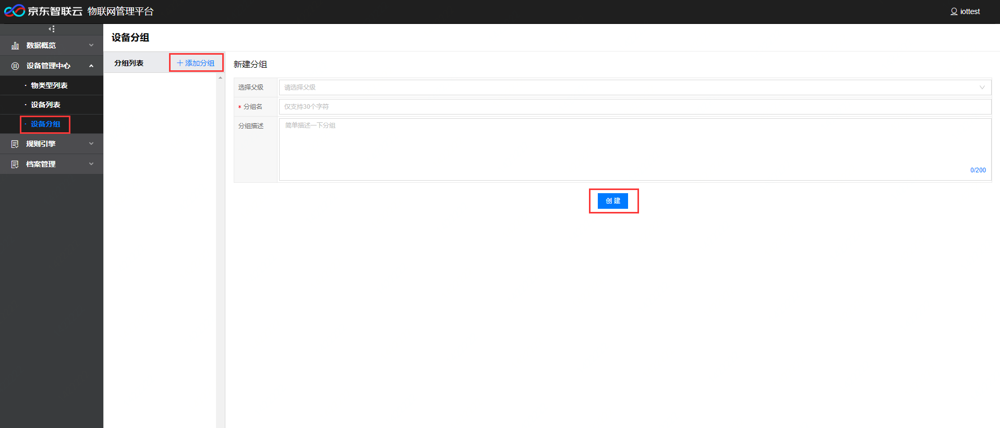
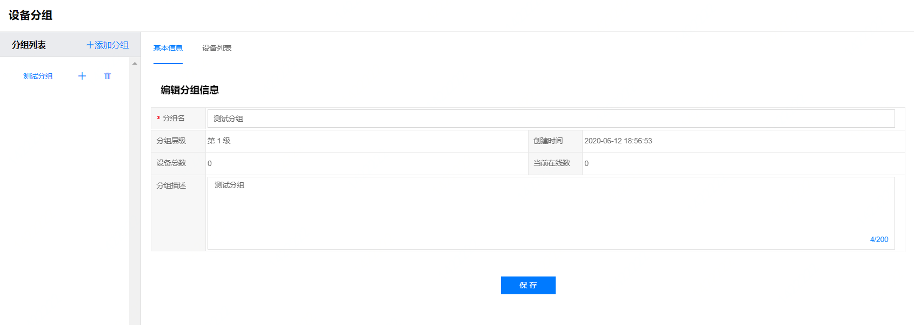
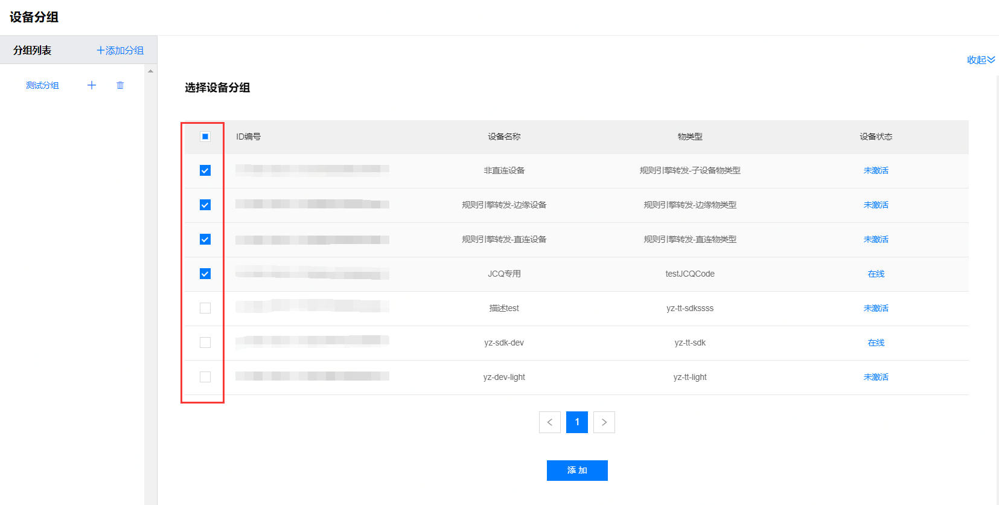
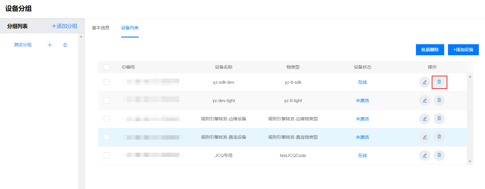
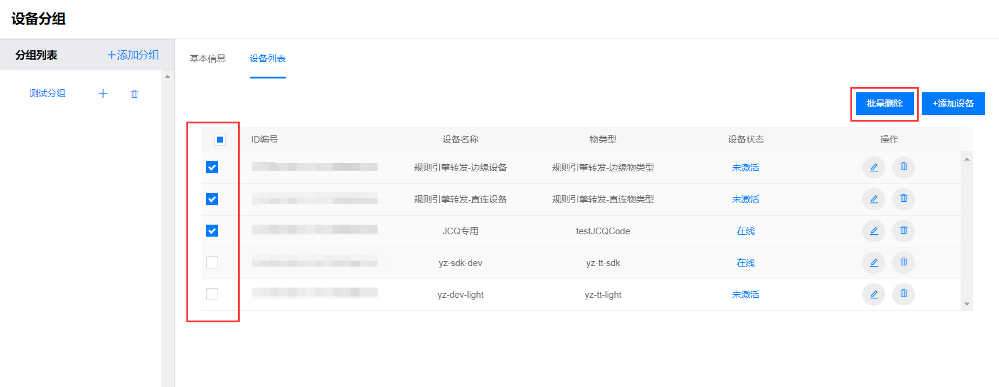
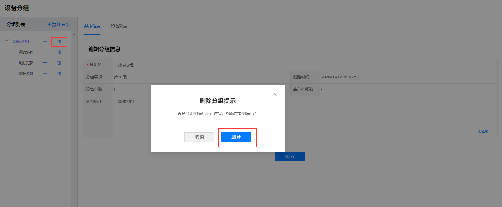

# 设备分组

通过对设备分组可以对不同分组的设备进行批量处理。

## 新增分组

1. 登录物联管理平台
2. 选择左侧导航栏中 **设备管理中心** -> **设备分组**
3. 点击**添加分组**

选择父级组(最多支持两级)，填写分组名称，分组描述，点击创建。

## 编辑分组

点击要编辑的分组名称，进入该分组编辑页面，显示该分组的基本信息及设备列表。

### 基本信息

显示该分组名，分组层级，创建时间，分组下设备总数，分组中当前在线设备数，分组描述等，可进行编辑并保存。

### 设备列表

添加或删除设备到当前分组。

**添加设备**

选择分组，点击添加设备，勾选要添加的设备，点击添加。

- 注： 二级下的设备分组可添加的设备列表必须是父级已添加设备的子集，若父级未添加设备，则该分组没有可添加的设备。

**删除设备**

删除设备分单个删除和批量删除两种方法。

**批量删除设备**

勾选要删除的设备信息，点击批量删除。

## 删除分组

点击要删除分组的删除按钮，弹出确认删除框，点击删除。

