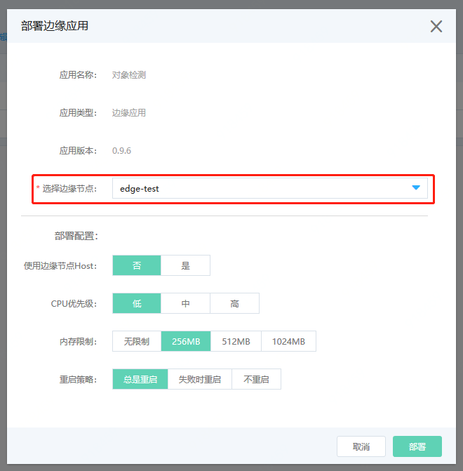

# 管理边缘应用

您可以通过物联网智能边缘计算控制台，管理边缘应用。

## 前提条件

- 已经完成Edge系统的安装，并且保持边缘节点在线。
- 已经开通对象存储业务，并创建好一个用于存储边缘计算结果数据的Bucket。如未开通，请先进入[对象存储](https://oss-console.jdcloud.com)控制台申请开通服务。
- **注意：当边缘节点处于未激活、离线或者系统更新状态时，无法进行应用的相关操作。**

## 部署安装边缘应用

1. 登录 [物联网智能边缘计算控制台](https://iot-console.jdcloud.com/iotedge)。

2. 点击左侧菜单进入“边缘应用”页面，首次进入“边缘应用”页面，会请求获取您的镜像仓库和对象存储的访问授权，请您同意授权，否则将无法正常部署安装应用。同意授权后，请您务必指定应用数据的对象存储路径。

3. 在应用列表页中，您可以看到目前物联网平台上已经发布上线的应用。边缘应用分为两类：一类是设备服务类边缘应用，一类是标准边缘应用。

   ### 部署设备服务

   点击设备服务应用后面的部署按钮，打开部署页面。

    

   选择需要安装设备服务的边缘节点后，点击部署。边缘节点会收到安装指令，自动安装设备服务。

   ### 部署边缘应用
   
   点击边缘应用后的部署按钮，打开部署页面。
   
    
   
   | 参数             | 说明                                                         |
   | ---------------- | ------------------------------------------------------------ |
   | 选择边缘节点     | 需要部署安装应用的边缘节点名称。                             |
   | 使用边缘节点Host | 边缘应用在运行时是否使用边缘节点系统的Host。默认为【否】     |
   | CPU优先级        | 边缘应用运行时，申请的CPU运行权限，默认为【中】              |
   | 内存限制         | 边缘应用运行时，最多使用的内存数。                           |
   | 重启策略         | 总是重启：应用退出后自动重启                                                                                                                失败时重启：应用异常终止时重启                                                                                                                   不重启：应用终止后不重启。 |

按页面提示选择需要安装应用的边缘节点，并选择好相关配置，完成选择后点击部署

## 删除边缘应用

​		在已经创建完成的消息路由列表后方，点击启动或停止，可对当前消息路由进行启动或停止操作。

​		1. 消息路由为启动状态时，可对其进行停止操作。

​		2. 消息路由为停止状态时，可对其进行启动操作。

## 启停边缘应用

​		在已经创建完成的消息路由列表后方，点击编辑，可对当前消息路由的消息源和消息目的端进行编辑更新操作。

​		

## 配置边缘应用

​		 在已经创建完成的消息路由列表后方，点击删除，可以删除当前的消息路由。删除成功后，该条消息路由将不会再列表中显示。

### 		参数配置

### 		更新影子（应用）

| 参数              | 描述                       | 输入说明                                                     |
| ----------------- | -------------------------- | ------------------------------------------------------------ |
| detectHardware    | 应用运行时使用的硬件资源   | 0:CPU 仅使用CPU进行计算 ，1:GPU 仅使用GPU进行计算，2:HDDL 仅使用HDDL进行计算，3:MYRIAD 仅使用英特尔Movidius计算棒进行计算 ，20:HDDLCPU 优先使用HDDL计算，CPU辅助计算 ，30:MYRIADCPU: 优先使用英特尔Movidius计算棒计算，CPU辅助计算。默认值为：0:CPU |
| targetLabels      | 需要检测的目标标签         | 填写期望的检测对象Label。最大填写Label数为10个。为空则应用依据最大检测数和设定的置信度，输出对应的检测结果。填写方式为{"label1","label2","label3"}参考示例{"person","cup",”bicycle“}。 对象检测应用默认的模型Label请参考[Label文件](../../../../image/IoT/IoT-Edge/objectLabel.txt) |
| recordVideoSwitch | 开启录像开关               | ON/OFF。默认值为ON                                           |
| duration          | 录像时长                   | 单位：秒，类型：整型，输入范围：5~30，步长为1 。默认值为：10 |
| modelFile         | 对象检测应用使用的AI模型文 | 填写对象检测应用使用的AI模型文件名，不能带扩展名。名称输入长度最长为：256个字符。 对象检测应用内置模型文件为：vgg_coco_ssd_300x300_openvino_FP16 |
| maxResults        | 最大检测结果数             | 类型：整型，输入范围：1~10，步长：1 。单帧图像对多检测的对象结果数。 默认值为3。 |
| threshold         | 置信度                     | 类型：浮点，输入范围：0.01~0.99，步长：0.01。当对象检测应用检测到的置信度≥该设定值时，才输出检测结果。默认值为：0.3 。 |

### 		调用服务（应用）

添加检测模型（ addModelFile ）

| 参数      | 描述                   | 输入说明                                                     |
| --------- | ---------------------- | ------------------------------------------------------------ |
| modelFile | 需要添加的AI模型文件名 | 名称输入长度最长为：256个字符。注意：不能输入内置AI模型文件名 vgg_coco_ssd_300x300_openvino_FP16 |
| url       | AI模型文件的下载地址   | 文件要求：必须为符合OpenVino框架的检测模型，格式为.tar.gz。注意：包中必须提供检测标签文件，格式为txt。 |

更新检测模型（ updateModelFile ）

| 参数      | 描述                   | 输入说明                                                     |
| --------- | ---------------------- | ------------------------------------------------------------ |
| modelFile | 需要更新的AI模型文件名 | 名称输入长度最长为：256个字符。 注意：用户不能对内置AI模型进行更新。 |
| url       | AI模型文件的下载地址   | 文件要求：必须为符合OpenVino框架的检测模型，格式为.tar.gz。注意：包中必须提供检测标签文件，格式为txt。 |

删除检测模型（ deleteModelFile ）

| 参数      | 描述                   | 输入说明                                                     |
| --------- | ---------------------- | ------------------------------------------------------------ |
| modelFile | 需要删除的AI模型文件名 | 名称输入长度最长为：256个字符。 对象检测应用内置模型文件不可删除。 |

## 相关参考

- [创建边缘计算节点](../../Getting-Started/Create-Edgenode.md)
- [安装Edge系统](../../Getting-Started/Install-Edge-System.md)                    