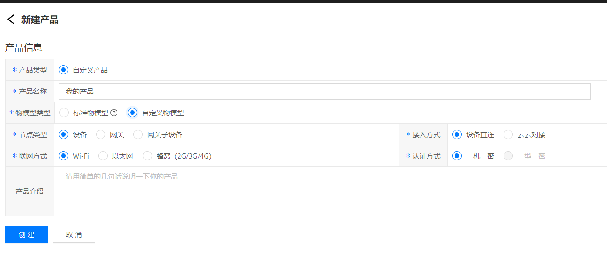
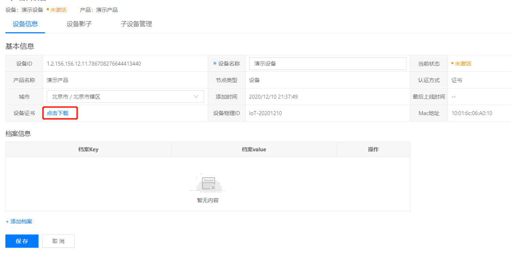
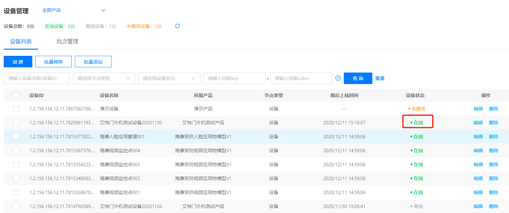

# 设备接入

登录智能生活物联管理平台官网， 共4步即可完成设备快速接入。

## 创建产品

进入**产品管理**->**产品列表**，点击**新建产品**，并按如下步骤操作：

设置产品名称，选择自定义物模型（或选择某个标准物模型），并设置节点类型为：设备，接入方式为：设备直连，联网方式、认证方式等。

点击**创建**，完成产品创建，然后进行产品物模型的定义调整

属性添加：点击**+添加属性**

设置好相关信息后，点击**确认**添加属性成功：

添加事件：点击**事件**，添加一个事件，设置事件上报参数的功能名称、标识符、读写权限等信息，

添加服务：点击**服务**，添加一个服务，设置服务的功能名称、标识符和输入输出参数等信息，

## 注册设备

进入**设备管理**->**设备列表**，点击**创建**，并按如下步骤操作：

设置基本信息，其中产品选择上一步创建的演示产品：

确认基本信息无误后，点击**创建**，即可完成设备的创建

## 下载设备证书

返回设备列表，找到刚注册成功的设备，点击**编辑**打开设备详情页面，点击**设备证书**后的下载链接

## SDK快速集成
将设备SDK集成到设备服务中，并将下载的证书导入存放到指定位置，按SDK文档说明填写配置信息连接EMQ服务。
启动服务后通过SDK连接到平台服务，自动触发设备上线消息，查看设备列表中设备状态为在线状态

