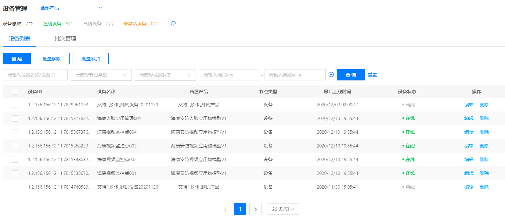
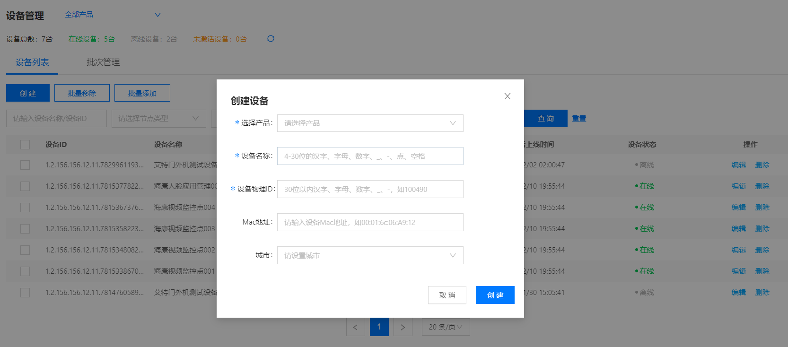
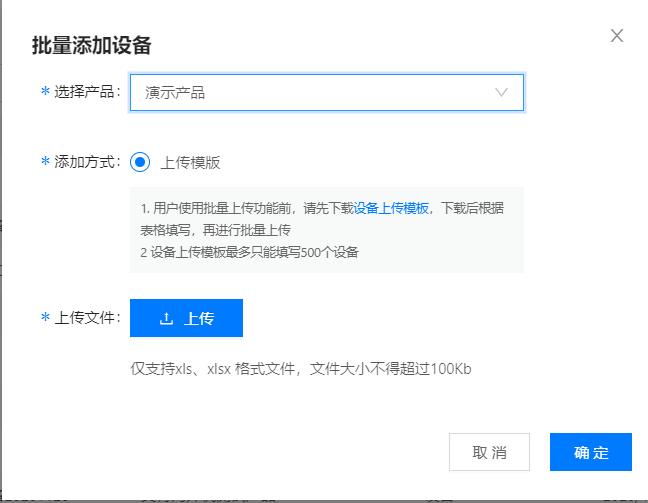
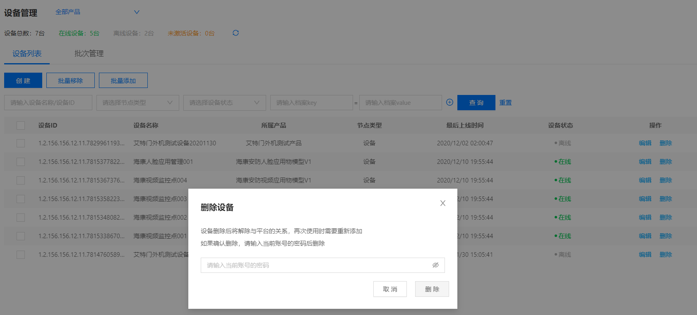

# 注册设备

1. 登录物联管理平台
2. 左侧导航栏选择 **设备管理** -> **设备列表**
3. 点击页面右上方 **创建**

4. 填写设备的基本信息、设备名称、MAC地址等。

**基本信息**
- 选择产品：下拉选择要创建设备所属产品
- 设备名称：设备的名称，仅支持30个以内的汉字、英文、数字、下划线(_)、连字符(-)、点(.)、空格。
- Mac地址：Mac地址请用冒号(:)分割，非必填。
- 设备物理ID:仅支持30个以内的汉字、英文、数字、下划线(_)，连字符(-)。
- 城市：注册设备所在城市。

## 批量添加设备
1. 登录物联管理平台
2. 左侧导航栏选择 **设备管理** -> **设备列表**
3. 点击页面右上方 **批量添加按钮**
4. 在页面选择产品信息，上传设备模板文件，批量导入设备

5. 在**批次管理**选项卡中可查看导入批次的处理情况

 ## 查询设备

 可根据ID编号，设备名称，所属产品，设备状态，节点类型等条件进行设备信息查询。点击重置可清空已选查询条件。

 ## 删除设备

在设备列表页面点击要删除的设备对应的**删除**按钮，输入当前登录用户密码进行验证，点击**删除**按钮。

