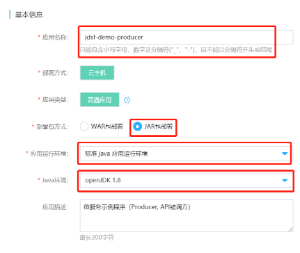
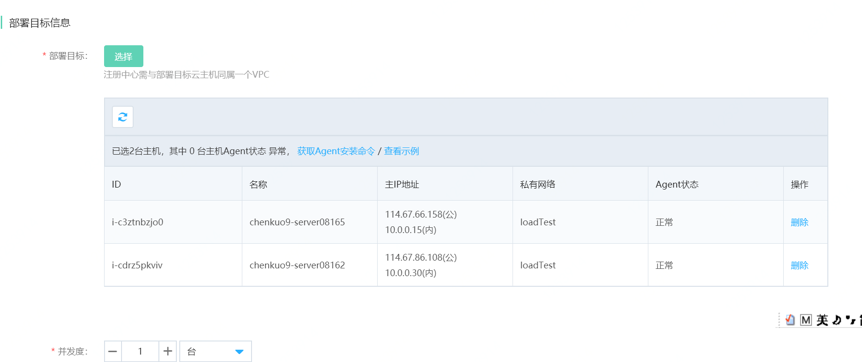
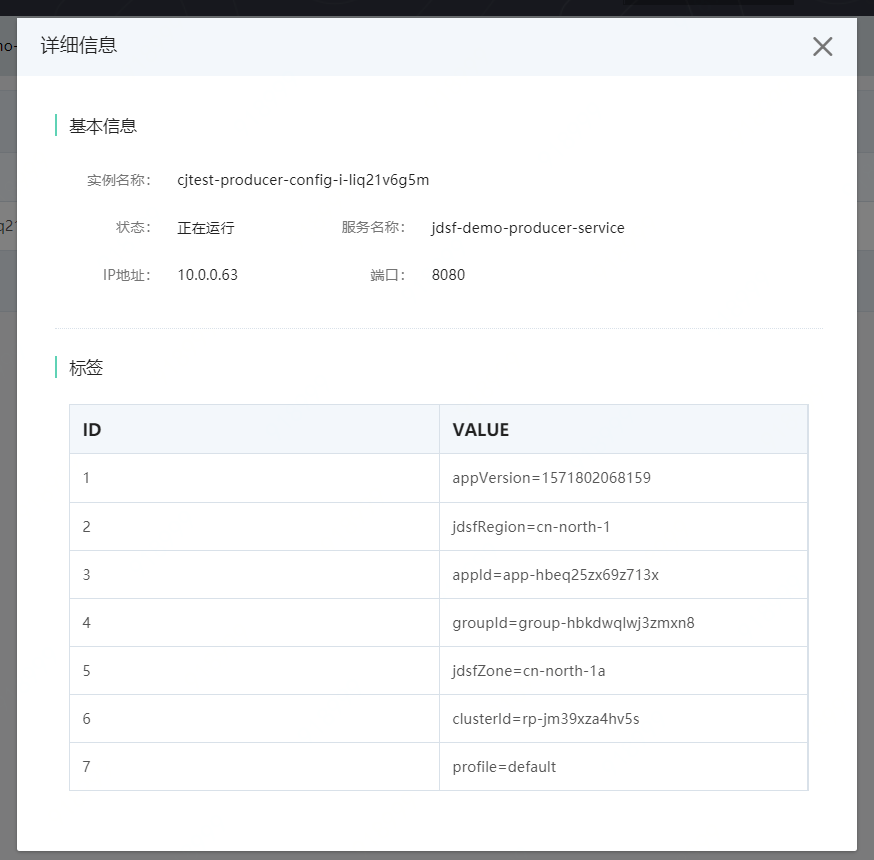
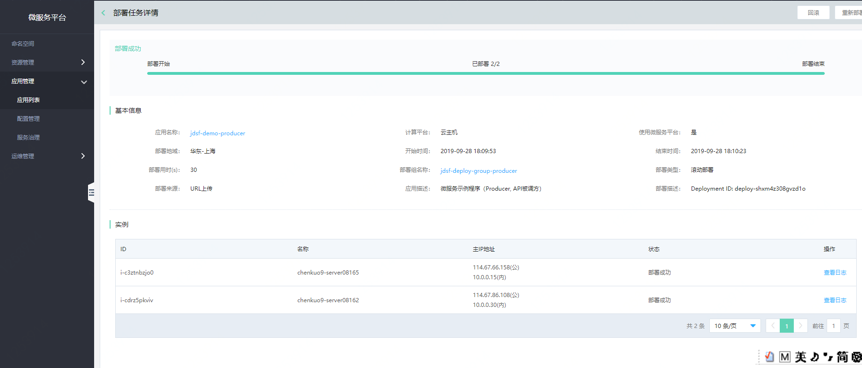
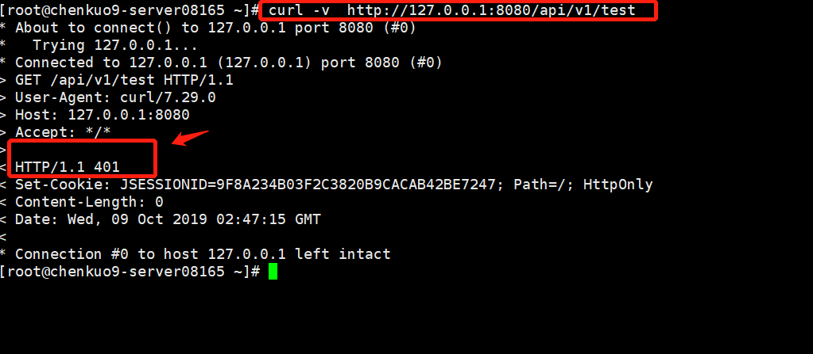

#  应用部署

在微服务平台上，应用可以通过部署组来实现部署，目前已提供支持在云主机执行部署。

## 操作场景

当新建完应用，需要通过部署程序包来实施应用在实例上的注册和发现。


## 环境准备

1、 准备云主机，安全组要求内网端口全开。必须开放的端口包含：50001、微服务端口。

2、已经开通所需资源如：云主机、微服务平台等。


## 操作步骤

### 第1步：创建应用

登录微服务平台控制台，可依次参考创建如下内容：

1、先创建命名空间。过程参考： [命名空间](../Namespace.md) 。

2、再创建资源池。并往资源池中导入云主机，用于应用的部署。过程参考： [创建资源池并导入云主机](../Resource-Manage/Resource-List.md)  。

3、接着创建应用。过程参考： [应用管理](APPList.md)  

**例如：**

您可创建名为 jdsf-demo-producer的应用，选择：JAR包部署，标准Java应用运行环境，OpenJDK1.8。




### 第2步：创建部署组

点击应用名称，进入部署组列表页，配置好将执行的部署组信息。

若尚未创建部署组，则需先新建。新建过程参考： [部署组](Deploy-Group.md)   。

**例如：**

当您创建完名为 jdsf-demo-producer的应用后，可按照如下步骤操作：

1、进入该应用的部署组tab页。

2、新建部署组，填写基本信息，选择部署目标。

例如：部署组名称（jdsf-deploy-group-producer），选择我们刚创建好的命名空间 （如： jdsf_dev_wys）


3、关联云主机。

例如：首先选择命名空间下的一个资源池，如我们刚建好的 jdsf_resource_sh_wys，然后选择此资源池下的两台云主机。

选择部署目标


完成关联云主机



4、填写部署组其他信息。如果无要求，默认即可。


5、部署完成。


### 第3步：配置关于发起部署的相关信息

目前支持两种部署来源：程序包、云编译。下面将分别介绍。
 


#####  程序包部署


注意：

- 为提升用户体验，**系统将在云主机中使用Supervisor来管理用户服务。**

- 选择要部署的程序包。如无则需先上传。

- 配置启动参数。


#####  云编译部署

如果您已经使用云编译进行了构建，可直接通过云编译部署。


注意：

- 请使用已执行成功且构建类型为应用包的构建序号。

- 路径，指运行jar/war包的相对路径，是相对于云编译 out_dir文件夹的路径。

- “应用版本号”将注册于注册中心 tag 中的 appVersion 里。您可在注册中心的服务实例详细信息中查看到该参数。服务实例详细信息位置：注册中心>服务管理>实例详情>实例详细信息 。




### 第4步：实施部署




**说明：**

- 部署完成后，可进行回滚、重新部署等操作。

- 用户还可查看每个实例的部署信息。

- 删除应用时，将可同时删除程序包和历史记录。


### 第5步：验证部署。

验证部署的应用是否已正常启动，可采用如下方式：

##### 方法1：如果有外网且开放了相应端口，可以直接访问。

```
{ip}:{端口}/API路径
```  
若响应码为200且返回 "status": "OK" 等信息，表示调用成功。例如下图示例供参考：


##### 方法2：登陆部署该应用的机器查看。

执行以下代码：

```
   curl -v http://127.0.0.1:{端口}/API路径
```  
若响应码为200且返回 "status": "OK" 等信息，表示调用成功。例如下图供参考：


##### 方法3：判断服务间的调用。

若 Consumer与Producer 应用均已部署， 且在同一命名空间下，可在请求Consumer以下的地址，发起对Producer的调用。 例如下图示例供参考：


若返回 "status": "OK" 等字样信息 ,表示服务间调用正常。


##### 方法4：通过 curl方式。

若已开启服务治理鉴权功能，可通过以下代码查看状态码，或直接在POSTMAN中使用外网IP请求查看状态码，判断请求是否已被拦截。

```
    curl -v 
```  

例如下图示例供参考：


(上图内容为启用鉴权后，请求被拦截的状态)

