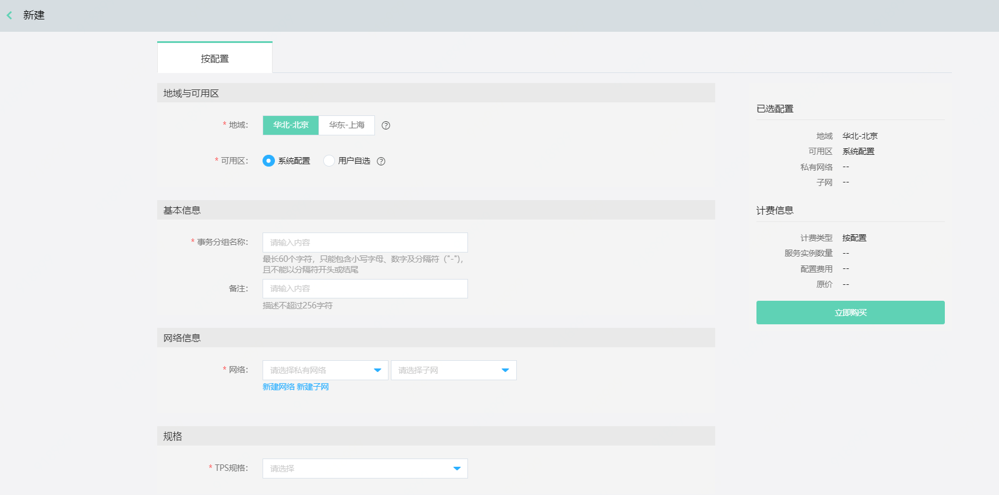
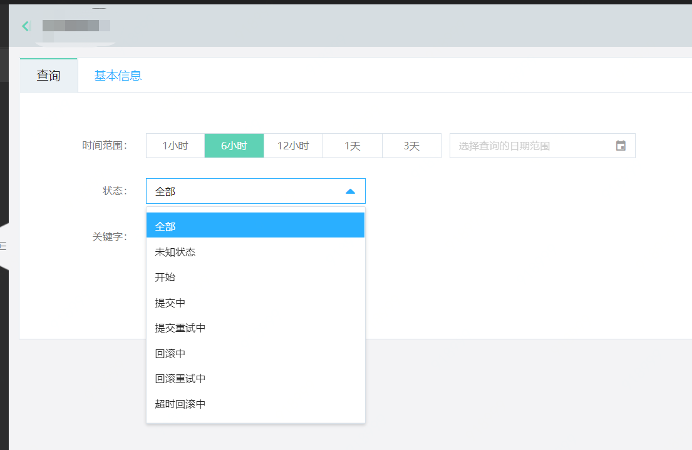
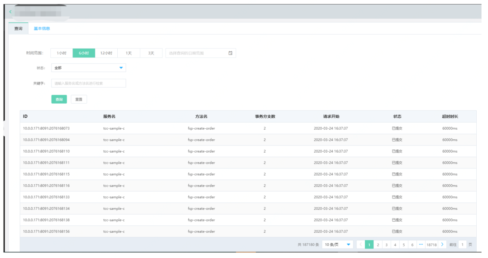
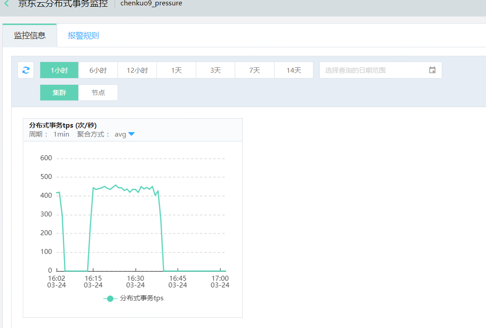
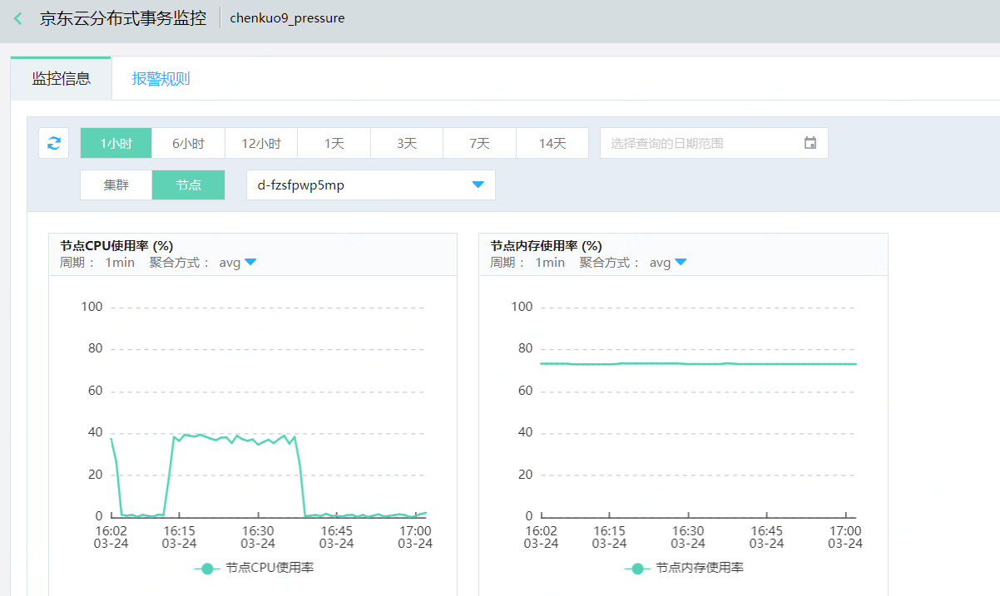

#  事务服务信息

控制台给用户提供了事务服务信息总览，方便用户查询事务交易记录、定位事务异常问题。用户可根据业务规模购买相应规格的事务服务实例。

启用服务步骤概括如下：首先购买事务服务，然后添加注释或添加依赖方式启动服务。添加成功后，您将可在控制台事务总览页中查看到该条事务的详情。

本章节将向您介绍如下内容：

- [创建JDTS服务](instance-type-family#cjjdtsfw)
- [接入JDTS服务](instance-type-family#jrjdtsfw)
- [查看事务信息](instance-type-family#ckswxx)
- [处理超时事务](instance-type-family#clcssw)
- [卸载](instance-type-family#xz)
- [资源监控](instance-type-family#zyjk)

### 入口

-	互联网中间件>分布式事务

### 环境准备

- STEP1:已经开通VPC网络信息

-	STEP2:已创建JDTS服务

## 操作说明

### 创建JDTS服务

JDTS通过事务分组管理来事务会话。一次事务会话一般会包含一个或多个分支事务。因此，创建1个事务分组的过程即创建JDTS服务的过程。另外注意创建服务时需要注意同用户server 在同一个VPC中。

#### 第1步：登录控制台，点击新建。

菜单位置：互联网中间件>分布式事务 

                   

#### 第2步：根据业务需求，配置事务服务。

您在此购买页中，需选择当前事务服务将创建的地域和可用区，输入事务分组名称，根据评估业务峰值来选择 TPS 规格，然后单击立即购买。
 

 

#### 第3步：创建成功后，您将在事务总览页面中，看到该条新增的事务分组信息。

点击要查看的事务分组名称，在基本信息中，可查看到当前事务服务的基本信息和计费信息，以及事务服务的请求集群地址。
  

 	

### 接入JDTS服务

#### 第1步：在基本信息中，找到集群服务地址
  

 	
 
#### 第2步：设置事务服务地址等关键信息完成事务接入。

具体可根据DEMO使用说明： [DEMO](../../Getting-Started/Basic-Example.md) 。

### 查看事务信息

当您已经完成配置JDTS服务后，将可以在控制台上对事务服务信息进行查询。

#### 第1步：登录控制台，在事务分组列表中，点击要查看的事务分组名称，进入查询页。
   

 	

#### 第2步：在查询界面中，您可按需选择事务时间段、事务状态、或关键词，来查询事务信息。
    

 	
#### 第3步：在查询结果列表中，将提供主事务 ID、服务名、方法名、事务分指数、请求开始时间、状态、超时时长等信息。
   

 	

### 处理超时事务
目前JDTS提供自动重试机制，帮助用户处理超时事务。

1)	 主事务超时时限，支持用户在客户端的SDK 中自定义设置。若用户自定义该超时时限，那么后端事务系统会依据该设置判断事务是否已处于超时状态；若用户未配置该超时时限，则将使用默认配置，默认值为5分钟。

2)	 当事务超时后，后端事务系统会自动进行回滚。

3)	 后端事务系统对于回滚或提交失败的事务，框架会自动重试，如果5分钟后还未启动成功，系统将停止重试，用户可及时查询定位问题，或采取他方式处理。

4)	结束的事务交易数据保留3天，3天后数据将被清除。

### 卸载

#### 第1步：登录控制台，在事务分组列表中，选择要删除的事务分组，点击操作中的“删除”。

#### 第2步：删除后，相关依赖该服务的业务将不可用。

您还需要在代码中删除修改与该条事务相关的引用信息完成变更或者卸载。

### 资源监控

JDTS为用户提供了资源监控功能。因为分布式事务本身会耗用一定的资源，那么通过监控可帮助用户查询各时间段内的资源耗用情况。

入口：监控与运维>云监控>资源监控>分布式事务

- 监控维度包含针对集群的TPS监控。
    

 	
- 事务服务节点节点的CPU使用率、内存使用率监控。
  

 	

- 报警规则。用户可根据监控项进行报警规则的设置。配置过程可参考： [报警规则配置](../../../../Management/Monitoring/Operation-Guide/resource-monitoring/add-rule-in-batches.md) 

