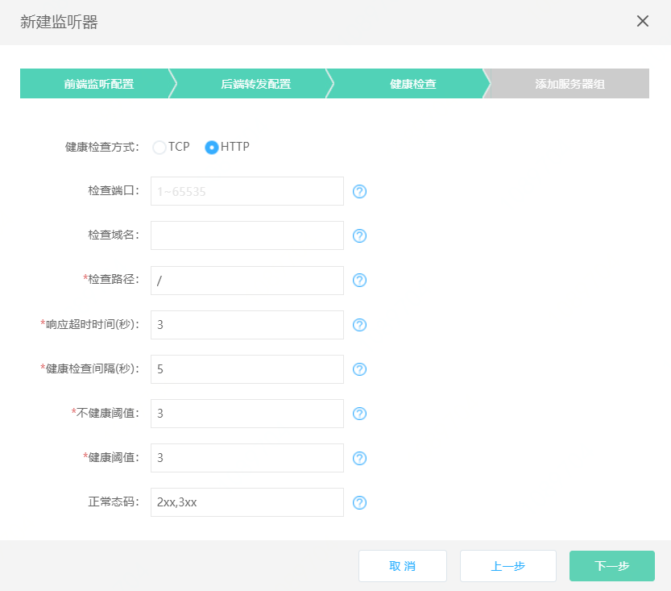
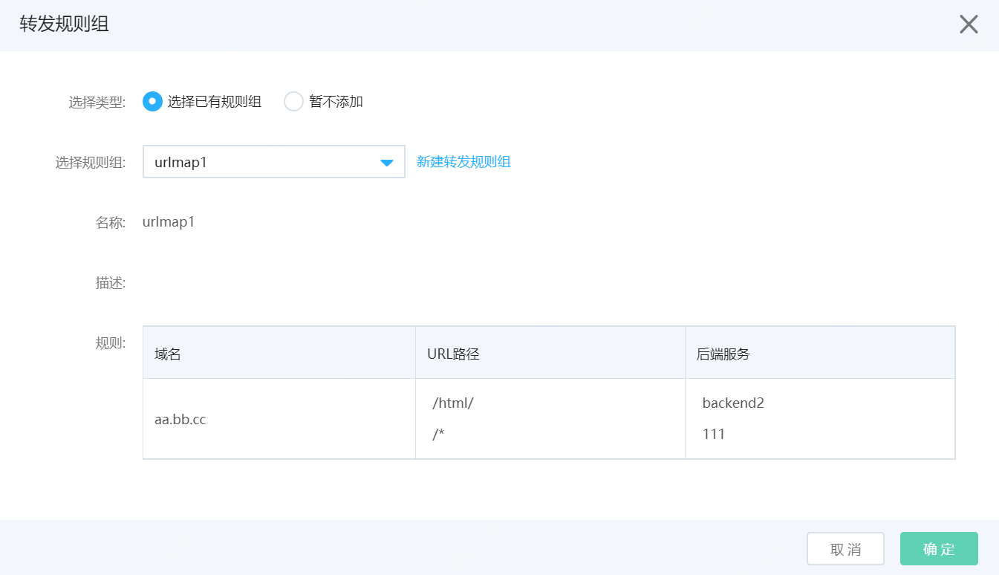

# 监听器管理

[添加监听器](listener-management#user-content-1)

[管理监听器](listener-management#user-content-2)

[编辑监听器](listener-management#user-content-3)

[管理监听器关联的转发规则组](listener-management#user-content-4)

[管理证书](listener-management#user-content-5)

[配置HSTS](listener-management#user-content-6)

## 添加监听器

1. 通过应用负载均衡-详情-监听器进入监听器管理页；

2. 点击新建监听器，打开监听器设置页；

3. 监听器设置：
	
	**前端监听配置：**
	
	- 选择前端监听协议：http、https、tcp、tls；端口：1-65535；	
		注：同一应用负载均衡下的监听端口不可重复，监听器创建后，监听协议、端口不允许修改；	
	- 空闲连接超时：输入范围1-86400秒；

		

	**后端转发配置：**

	- 默认后端服务：新建或选择一个已有的后端服务，选择已有后端服务相关参数不可修改；
	
	- 后端服务名称：定义后端服务名称，随监听器同步创建的后端服务可在后端服务列表查看；	
	
	- 后端协议：默认显示，如监听协议为http、https则后端协议为http，如监听协议为tcp、tls则后端协议为tcp；
	
	- 端口：后端业务转发端口，输入范围1-65535，不同后端服务的端口可以重复；
	
	- 调度算法：加权轮询、加权最小连接数、加权源IP，可根据实际业务需求选择；
	
	- 会话保持：默认关闭，后端协议为http时支持植入方式的cookie会话保持；	
	
	- cookie超时时间：输入范围0-86400，默认0代表与浏览器同生命周期；	
	
	- 获取真实IP：后端协议为http时，默认开启不可关闭，此时可通过X-Forwarded-For头字段获取客户端真实IP；后端协议为tcp时，支持proxy protocol协议方式透传客户端IP；
	
		注：当后端协议为tcp时，如开启获取真实IP，需在后端服务端完成proxy protocol的相关配置。
		
	- 获取http头字段：用于透传客户端http请求的相关信息。支持通过X-Forwarded-Proto字段获取负载均衡监听协议、通过X-Forwarded-Port字段获取负载均衡监听端口、 通过X-Forwarded-LBIP字段获取负载均衡VIP地址 、通过X-Forwarded-Host字段获取负载均衡监听目的IP（域名）和端口；

			

	**健康检查设置：**

	- 选择健康检查方式：HTTP、TCP；

	- 设置检查端口：输入范围1-65535，如不填写默认为后端实例接收负载均衡流量的端口；

	- 检查域名：健康检查的域名。支持输入域名和IP地址。如果输入域名，仅支持大小写字母、数字、英文中划线"-"和点"."，不区分大小写，且不超过255个字符。默认为空，表示健康检查不携带域名。仅健康检查方式为HTTP时支持填写。
	
	- 检查路径：健康检查的URL路径。必须以“/”开头，最多支持5级目录，不得超过100字符。仅健康检查方式为HTTP时支持填写。

	- 响应超时时间(s)：输入范围2-60秒,此为健康检查响应的最大超时时间；

	- 健康检查间隔(s):输入范围为5-300秒,此为健康检查的时间间隔；

	- 不健康阈值：输入范围1-5，此为后端实例从成功到失败的连续健康检查失败次数；

	- 健康阈值：输入范围1-5，此为后端实例从失败到成功的连续健康检查成功次数；

	- 正常态码：输入范围2xx（等价于200-299）、3xx（等价于300-399）、4xx（等价于400-499）。仅健康检查方式为HTTP时支持填写。

		

	**添加服务器组：**

	- 选择服务器组类型：虚拟服务器组/实例类型、虚拟服务器组/IP类型、高可用组，或者可以暂不添加；
	
	 
		
	
	- 虚拟服务器组/实例类型 或 虚拟服务器组/IP类型：系统会自动筛选出当前可以绑定的虚拟服务器组列表，如没有可用的虚拟服务器组，可点击“新建虚拟服务器组”进行创建；	
	
		  注：
		    * 虚拟服务器组/实例类型的后端服务器必须与应用负载均衡处于相同地域下的相同私有网络下。
		    * 当后端服务器位于VPC外（例如：后端服务器通过专线、VPC peering、VPN与应用负载均衡互通）时，请创建IP类型的虚拟服务器组。

	- 高可用组：系统会自动筛选出当前可以绑定的高可用组，如没有可用的高可用组，请前往高可用组页面进行创建；
	
	       注：可选高可用组中的后端服务器必须与应用负载均衡处于相同地域下的相同私有网络下。   

## 管理监听器

1. 查看监听详情：通过监听器列表页-操作栏，点击详情可查看监听器详细信息；

2. 启用/禁用监听器：通过监听器列表页-操作栏，可启用、禁用监听器；

3. 编辑监听器：通过监听器列表页-操作栏，可编辑监听器内容（详见下文）；

4. 删除监听器：通过监听器列表页-操作栏，可删除监听器。

	
## 编辑监听器

1. 证书：如监听器有绑定的证书，可修改；

2. 空闲连接超时：可修改；

3. 默认后端服务：可替换新的后端服务。注：只能选择与监听器协议匹配的后端服务，如监听协议为http、https，则可选后端协议为http的后端服务；如监听协议为tcp，则可选后端协议为tcp的后端服务。

4. 其他参数项不支持修改。

	
## 管理监听器关联的转发规则组

    注意：仅七层（HTTP/HTTPS）监听支持关联转发规则组，一个监听器只能关联一个转发规则组，同一个负载均衡下的多个监听器可以复用关联同一个转发规则组。

1. 通过监听器列表页-操作栏，点击**更多**弹出管理转发规则组对话框。
2. 在管理转发规则组对话框中，可为监听器关联、解关联及更换转发规则组。

## 管理证书

1. 通过监听器列表页-操作栏，点击**更多**弹出管理证书对话框。
2. 在管理证书对话框中，可配置一个HTTPS/TLS监听绑定多个证书，操作详见[证书管理](../Operation-Guide/Certificates-Management.md)。

## 配置HSTS

HSTS（HTTP Strict Transport Security，严格传输安全协议）是一种Web安全策略机制，通过强制客户使用HTTPS与服务器进行通信，降低客户端第一次访问服务器被劫持的风险。
网站开启全站HTTPS访问后，需要将所有的HTTP请求重定向到HTTPS，如果您在浏览器输入或直接单击HTTP链接，则服务器会将该HTTP请求重定向到HTTPS，该操作过程中HTTP请求可能被劫持，导致重定向后的请求未发送到服务器。HSTS通过在服务器返回的HTTP响应中返回HSTS header信息，以强制客户端在HSTS Header过期时间内访问网站域名时使用HTTPS，增加网站的安全性。

     注意：HSTS对子域名不生效。

1. 您可在创建HTTPS监听器及编辑HTTPS监听器时开启HSTS功能。
  - HSTS：HSTS开关，默认为关闭
  - 过期时间：HSTS Header的过期时间，开启HSTS后显示本参数。缺省为31536000秒（1年），范围为1-94608000秒（3年）
