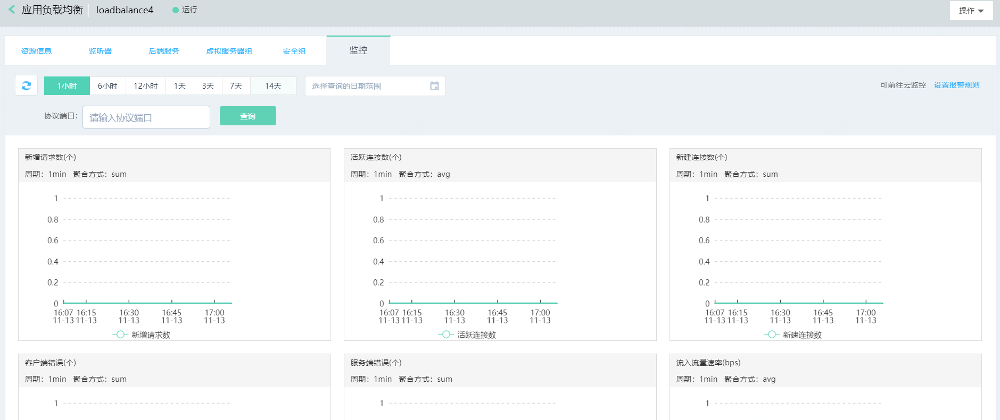

## 监控管理

1. 通过应用负载均衡-详情-监控打开监控页；

1. 选择查看数据的周期：支持查看最少1小时、最大14天或指定日期范围（当月最多30天）的监控数据；

1. 协议端口：默认显示应用负载均衡全部监听器的监控数据，也可输入指定的端口号查看对应监听器的监控数据；

1. 如您需要对监控指标设置报警规则，可点击“设置报警规则”前往云监控页面进行设置。

	

| 监控指标	| 说明	|
| :- | :- |
|新增请求数	|统计周期内，应用负载均衡处理的客户端HTTP/HTTPS请求数|
|活跃连接数	|客户端与应用负载均衡建立的所有ESTABLISHED状态的TCP连接数的平均值|
|新建连接数	|统计周期内，应用负载均衡收到的客户端新建TCP连接的请求数|
|服务端错误	|统计周期内，由于服务器端问题造成的请求失败数，例如：所有后端服务器不可用、后端连接超时、HTTP应答头部过大或格式有误等|
|客户端错误	|统计周期内，由于客户端问题造成的请求失败数，例如：客户端连接超时、HTTP HOST字段格式有误、HTTP请求行字段格式有误、HTTP请求头部过大或者格式有误、HTTPS TLS请求格式有误、HTTPS TLS版本过低或者无共享秘钥套件等|
|负载均衡返回状态码 |统计周期内，应用负载均衡返回的4XX和5XX HTTP状态码数|
|后端服务器返回状态码 |统计周期内，后端服务器返回的2XX、3XX、4XX和5XX HTTP状态码数|
|流入流量速率	|统计周期内，客户端访问应用负载均衡的流量速率|
|流出流量速率	|统计周期内，应用负载均衡将流量转发给客户端的速率|
|流入字节数	|统计周期内，客户端访问应用负载均衡流量的字节数|
|流出字节数	|统计周期内，应用负载均衡转发给客户端流量的字节数|
|总字节数	|统计周期内，流入字节数和流出字节数的和|
