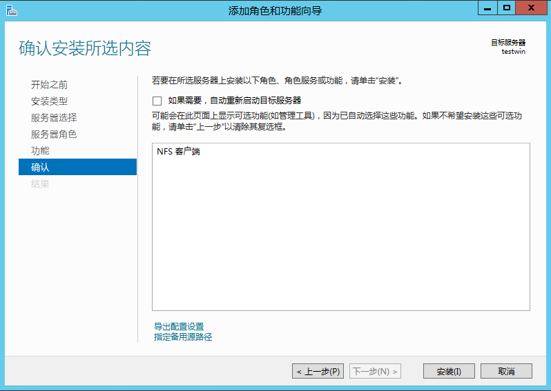
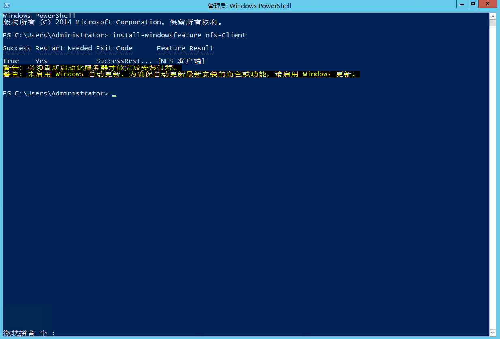
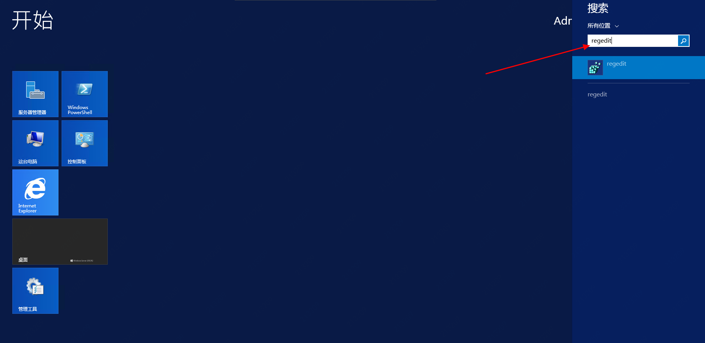
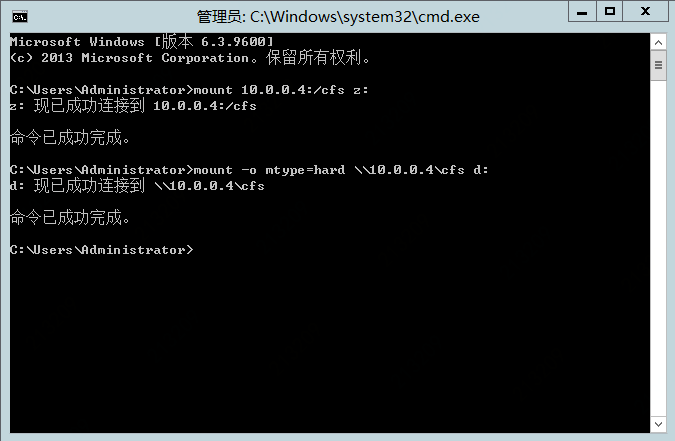

# windows挂载云文件服务（公测）

Windows Server 2008、Windows Server 2012 R2 及Windows Server 2016均支持使用NFS 3.0协议，可通过在上述版本的操作系统上安装NFS客户端来挂载京东云云文件服务（CFS）。

## 操作步骤

以下以windows Server 2012为例，介绍在windows Server操作系统中挂载云文件服务（CFS）的步骤，Windows Server 2008 与 Windows Server 2016下的操作步骤类似。

1. 登录京东云，在控制台创建Windows操作系统的云主机，创建操作可参考https://docs.jdcloud.com/cn/virtual-machines/create-windows-instance

2. 云主机创建成功后，通过控制台或远程桌面连接登录云主机。安装NFS客户端功能。

   可以选择使用PowerShell安装或者选择服务器管理器安装。

   2.1 服务器管理器安装

   1）打开“服务器管理器”功能，点击“添加角色和功能”，单击“下一步”；

	2）进入“安装类型”，默认选择“基于角色或基于功能的安装”，无需修改，单击“下一步”；

	3）进入“服务器选择”，默认选中当前服务器，无需修改，单击“下一步”；

	4）在“功能”中，勾选”NFS客户端“，单击”下一步“；

	5）在”确认“窗口中点击”安装“按钮，开始安装。

2.2 windows PowerShell安装

打开windows PowerShell，执行：

 `install-windowsfeature nfs-Client` 

2.3 无论使用上述哪种方式安装NFS客户端，安装完成后**均需要重启云主机**，以完整完成NFS客户端的安装。

3. 重启后，需要修改注册表，以获取root权限对CFS内的目录和文件进行读写，方式如下：

   3.1 按win+R，输入regedit或者在应用搜索中找到regedit，运行注册表编辑器；

   

   3.2 在注册表中找到HKEY_LOCAL_MACHINE\SOFTWARE\Microsoft\ClientForNFS\CurrentVersion\Default 这项，并增加AnonymousUid和AnonymousGid 两个 REG_DWORD 值，数值为0。

   修改完成后，重启虚机，以使注册表修改生效。

   

4. 重启该云主机，以完成nfs-client的安装及修改的注册表生效。

5. 重启云主机后，打开cmd，执行：

    `mount -o mtype=hard \\10.0.0.4\cfs d:` 

   其中 10.0.0.4\cfs 为挂载目标，请根据您实际的挂载目标地址做调整； d: 为目标盘符，可根据您需要挂载的盘符做调整； -o mtype=hard 指定为异常情况时恢复行为为hard，即CFS服务异常时， nfs-client会持续重试，直至重新连接。

   挂载成功后，如下图所示，在“资源管理器”中也可看到挂载好的CFS服务。

   

   

   
